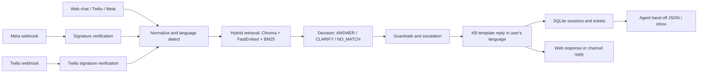
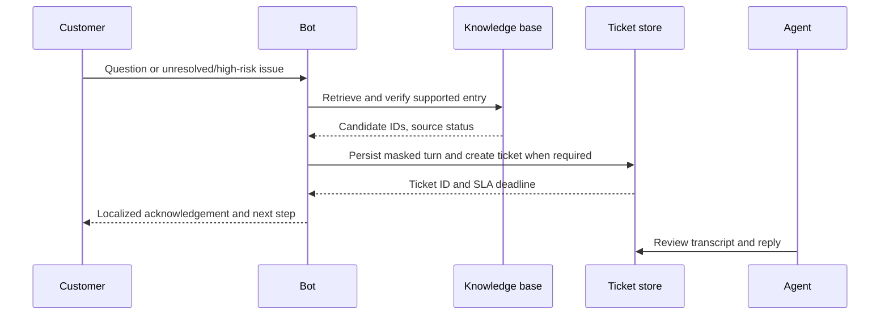

# Architecture

```mermaid
flowchart LR
 U[Web chat / Twilio / Meta] --> N[Normalize and language detect]
 M[Meta webhook] --> S1[Signature verification]
 T[Twilio webhook] --> S2[Twilio signature verification]
 S1 --> N
 S2 --> N
 N --> R[Hybrid retrieval: Chroma + FastEmbed + BM25]
 R --> D[Decision: ANSWER / CLARIFY / NO_MATCH]
 D --> G[Guardrails and escalation]
 G --> A[KB template reply in user's language]
 A --> DB[SQLite sessions and tickets]
 DB --> H[Agent hand-off JSON / inbox]
 A --> W[Web response or channel reply]
```

```mermaid
sequenceDiagram
 participant C as Customer
 participant B as Bot
 participant K as Knowledge base
 participant T as Ticket store
 participant A as Agent
 C->>B: Question or unresolved/high-risk issue
 B->>K: Retrieve and verify supported entry
 K-->>B: Candidate IDs, source status
 B->>T: Persist masked turn and create ticket when required
 T-->>B: Ticket ID and SLA deadline
 B-->>C: Localized acknowledgement and next step
 A->>T: Review transcript and reply
```
